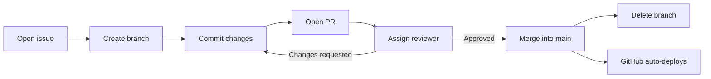

# Contributing

Read this before contributing! Why?

Standards help keep the project organized and maintainable over time. Future maintainers should be able to understand what changed, why it changed, and where to look for more information without needing to ask the original developers. Remember, you are not the only one working on this project.

Consistent branch names, commit messages, issue titles, and pull request titles make the project's history easier to search and understand. This is especially useful when reviewing past issues and pull requests or when handing the codebase over to the next web dev team.

Compare these commit messages:

```bash
hope this works                                     # Vague: What happened? :(
fix(home): update invite link to Discord server     # Clear: I know what changed and where. :)
```

The second message is more informative at a glance.

Conventions keep work clear and traceable. You don't need to perfectly understand them before contributing. Just be conscious of how future developers will interpret your work. When in doubt, write a concise description of what changed and ask another developer for help.

## Workflow

> If you are new to Git, you do not need to understand everything immediately.
> Reach out for help if you need it.



This is the _recommended_ workflow to keep everything organized and traceable. Considering the scope of this project, it is not a strict requirement to follow this. However, it is _highly recommended_ to maintain some structure (refer to the section above). Future web dev teams will benefit from a clear project history.

**For small-scale changes:** At minimum, test your changes and write a clear commit message.

**For large-scale changes:** Follow the full workflow.

### 1. Open an Issue

[Open an issue](https://github.com/sjsugamedev/sjsugamedev.github.io/issues) for noteworthy work, such as:

- New pages
- New features
- Bug fixes
- Structural changes
- Significant content updates

Tiny fixes, such as correcting a typo or changing one image reference, do not require an issue.

### 2. Create a Branch

Before making changes, create a branch from `main`.

Use one of the following prefixes:

| Prefix   | Purpose           | Example                      |
| -------- | ----------------- | ---------------------------- |
| `feat/`  | New features      | `feat/faq-section`           |
| `fix/`   | Bug fixes         | `fix/broken-youtube-link`    |
| `chore/` | Maintenance tasks | `chore/update-documentation` |

### 3. Make and Test Your Changes

Make your changes using only HTML, CSS, and JavaScript. **Do not add frameworks, build systems, or unnecessary dependencies.**

Before opening a pull request, test the website locally and make sure nothing is broken, including archived pages.

Run the server locally:

```bash
python -m http.server 8000
```

Then open [localhost:8000](http://localhost:8000/).

### 4. Commit Your Changes

Use the [Conventional Commits](https://www.conventionalcommits.org/en/v1.0.0/) format:

```
type(scope): short description
```

Write short, descriptive commit messages in the present tense. Include a scope when it adds useful context.

Example commit messages:

```
feat(events): add upcoming events section
fix(header): correct YouTube link
refactor(assets): reorganize archived images
docs(contributing): update contributing guide with workflow
style(formatting): format HTML and CSS
```

Commits should be focused on one logical change whenever possible.

Here's a quick cheatsheet of the semantics (not everything will apply to this codebase):

| What did you do?                            | If yes, use |
| ------------------------------------------- | ----------- |
| Bug fix?                                    | `fix`       |
| New or changed feature?                     | `feat`      |
| Performance improvement?                    | `perf`      |
| Code restructuring without behavior change? | `refactor`  |
| Formatting only?                            | `style`     |
| Tests added or corrected?                   | `test`      |
| Documentation only?                         | `docs`      |
| Build tools, dependencies, or versions?     | `build`     |
| DevOps, infrastructure, or backups?         | `ops`       |
| Anything else?                              | `chore`     |

### 5. Open a Pull Request

[Open a pull request](https://github.com/sjsugamedev/sjsugamedev.github.io/pulls) after testing your changes.

When opening a pull request:

- Use a clear title.
- Describe what changed.
- Link the related issue when applicable.
- Include `Closes #<issue-number>` to automatically close the issue after merging.
- Assign a reviewer.

Example PR titles:

```
Feature: FAQ Section
Fix: Broken YouTube Link
Chore: Codebase Restructure
```

### 6. Review and Merge

If changes are requested, update your branch and push the new commits addressing those requests.

After the pull request is approved:

1. Merge the pull request into `main`.
2. Delete the branch.
3. Confirm that GitHub Pages deployed the changes successfully.

## Project Guidelines

### Tech Stack

The website uses only:

- HTML
- CSS
- JavaScript

The site should remain understandable and maintainable without requiring additional knowledge.

### Archived Pages

Per the advisor's request, archived HTML pages must remain in the repository root so they stay discoverable. **Do not move or remove these pages from the root directory.** This will break existing links to them.

Archived assets and supporting files may be organized under `archive/`, provided that all references are updated.

### File Organization

- Current and archived HTML pages remain in the repository root.
- Current stylesheets belong in `assets/css/`.
- Current scripts belong in `assets/js/`.
- Current images belong in the appropriate folder under `assets/img/`.
- Archived stylesheets belong in `archive/assets/css/`.
- Archived images belong in the appropriate folder under `archive/assets/img/`.

Full project structure is in the [README](README.md#project-structure).

Create new directories as applicable. For example, if an `archive/js/` directory must be made to archive a script.

### File Naming

Use lowercase [kebab-case](https://developer.mozilla.org/en-US/docs/Glossary/Kebab_case) for file names:

```
global-game-jam-01.png
global-game-jam-02.png
officer-cards.js
```

Follow these rules:

- Use lowercase letters.
- Separate words with hyphens.
- Use descriptive names.
- Use zero-padded numbers for sequences (`01`, `02`, `03`) so numbers stay aligned.
- Avoid spaces and underscores.

When moving or renaming an asset, update every reference to that asset.

### Formatting

Use consistent indentation and formatting for HTML, CSS, and JavaScript.

[Prettier code formatting](https://prettier.io/) is optional, but recommended so teams have consistently formatted files.

Keep formatting-only changes separate from functional changes whenever possible:

```
feat(auth): add login page
style(formatting): format files with Prettier
```
