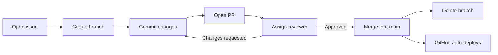

# Contributing
> *A rough draft. Will flesh this out later.*
> 
> Last updated: 9/13/2026

## Workflow



1. **Open an issue.** This can be for a new page, new feature, structural changes, or anything noteworthy. Do not open an issue for tiny fixes.
2. **Create a branch.** Branch off of `main` and name the new branch using one of these prefixes. Commit messages, issue title, and PR titles also follow this convention to keep things labeled consistently.

   | Prefix | Purpose | Example |
   |---|---|---|
   | `feature/` | New features | `feature/faq-section` |
   | `fix/` | Bug fixes | `fix/broken-youtube-link` |
   | `chore/` | Non-coding tasks | `chore/contributing-doc` |

    For example, if you were adding an FAQ section to the home page, this is how your names would look like:
    - Branch: `feature/faq-section`
    - Commit: `feature: add FAQ section`
    - Issue: `Feature: FAQ Section`
    - PR: `Feature: FAQ Section`

3. **Open a PR.** Link the issue if it exists (ie. `Closes #10`) and assign someone to review the PR. When approved, merge into `main`, then delete the branch. The website will automatically update.

## File Organization

Everything is in plain HTML/CSS/JS. This is for maintainability as per our club advisor's guidance. Anyone who picks up the codebase should be able to understand it easily without learning anything extra (ie. React, Tailwind, TypeScript).

<!-- TODO: reorganize codebase and update this section -->

<!-- if we end up using git tags -->
<!-- ## Snapshots

To keep a record of our website over the years, we use [Git tags](https://git-scm.com/book/en/v2/Git-Basics-Tagging) to prevent cluttering the branch list. Tag the commit to take a snapshot, and name it with the `archive/` prefix. 

```bash
git tag archive/YYYY-website
git push origin archive/YYYY-website
```

Then check out the tag to see the codebase at that point in time. 

```bash
git checkout archive/YYYY-website
``` -->