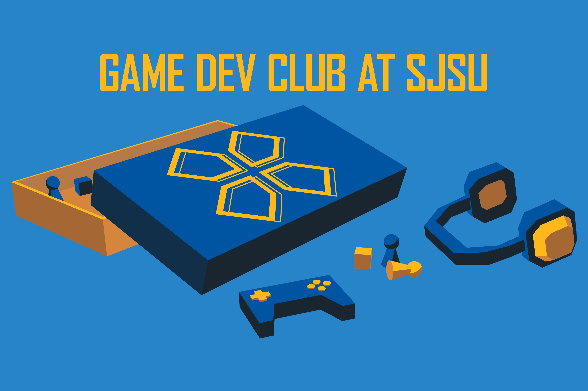

# SJSU Game Dev Club Website



## Overview

This repository contains the official website for SJSU's Game Dev Club.

- **Tech Stack:** HTML, CSS, and JavaScript
- **Host:** GitHub Pages

For maintainability, the website only uses HTML, CSS, and JavaScript. This ensures that future maintainers can easily understand and contribute to the website without requiring any additional knowledge outside of the basics.

## Project Structure

```
sjsugamedev.github.io/
│
# items for archived pages
├─ archive/
│  ├─ assets/
│  │  ├─ css/           # styles
│  │  └─ img/
│  │     ├─ ggj/        # images for ggj202x.html pages
│  │     ├─ jam/        # images for jam202x.html pages
│  │     ├─ shared/     # images shared by archived pages
│  │     └─ summer/     # images for summer202x.html pages
│  └─ constitution.pdf  # old club constitution
│
# assets for current pages
├─ assets/
│  ├─ css/          # styles
│  ├─ img/
│  │  ├─ events/    # images for the events page
│  │  ├─ index/     # images for the home page
│  │  └─ shared/    # images shared by current pages
│  └─ js/           # scripts
│
# current pages
├─ index.html
├─ events.html
├─ games.html
│
# archived pages
├─ ggj2021.html
├─ ggj2022.html
├─ ggj2023.html
├─ ggj2024.html
├─ jam2020.html
├─ jam2021.html
├─ summer2021.html
├─ summer2022.html
├─ summer2024.html
├─ summer2025.html
│
├─ .gitignore
├─ CNAME            # custom domain name
├─ CONTRIBUTING.md
└─ README.md        # you are here!
```

Per our advisor’s request, the archived HTML pages remain in the root directory so they stay discoverable. **Do not move these pages from the root.** Supporting files can be reorganized under `archive/` provided that all references are updated accordingly.

## Getting Started

You will need:

- Git, to contribute to the repository
- Python, to run the website locally

1. Clone the repository.

```bash
git clone https://github.com/sjsugamedev/sjsugamedev.github.io.git
```

2. Move into the root directory.

```bash
cd sjsugamedev.github.io
```

3. Run the website locally.

```bash
python -m http.server 8000
```

4. Open http://localhost:8000/ in your browser to see the website.

## Contributing

Review the project's [contribution guidelines](CONTRIBUTING.md) before contributing. This covers the project workflow, asset organization, naming conventions, and formatting expectations.

## Maintainers

This website is maintained by Game Dev Club's web development team for the 2026 - 2027 school year.

- **Club Advisor:** James Morgan
- **Web Director:** Andrew Hiponia
- **Web Assistant:** Gianna Nicomedes
